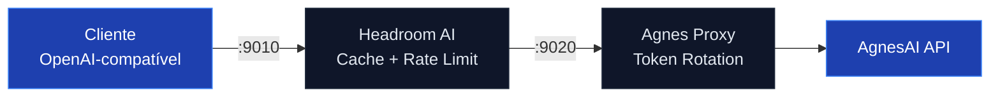

# Agnes Token Proxy

Proxy de rotação automática de tokens para AgnesAI. Gerencia múltiplos tokens com round-robin e integra com Headroom AI para caching e otimização de requisições.

## Requisitos

| Requisito | Versão |
|-----------|--------|
| Headroom AI | ≥ 0.39.1 |
| Rust toolchain | stable |
| Tokens AgnesAI | válidos |

- Pegue seus tokens aqui: https://platform.agnes-ai.com/

## Arquitetura



### Como funciona

1. **Headroom AI** (porta 9010): recebe requisições do cliente, aplica cache e rate limiting
2. **Agnes Proxy** (porta 9020): recebe requisições do Headroom, seleciona token via round-robin e forward para AgnesAI
3. **Token Rotation**: distribui requisições uniformemente entre todos os tokens cadastrados
4. **HTTPS**: usa rustls com certificados nativos do sistema para conexões seguras

## Modelo agnes-2.5-flash

| Especificação  | Valores                                                                                |
| -------------- | -------------------------------------------------------------------------------------- |
| Input tokens   | até **512K** de contexto                                                               |
| Output tokens  | até **65.5K**                                                                          |
| Context window | **512K tokens**                                                                        |
| API            | **OpenAI-compatible**                                                                  |
| Endpoint       | `/v1/chat/completions`                                                                 |
| Reasoning      | **Sim**                                                                                |
| Tool calling   | **Sim**                                                                                |
| Vision         | **Sim**, via imagem                                                                    |
| Streaming      | **Sim**                                                                                |
| Velocidade     | Alta — modelo Flash                                                                    |
| Custo          | **Atualmente grátis em promoção**; referência de preço: $0,03/M input e $0,15/M output |

## Instalação

```bash
# Compilar
cargo build --release
# Binário: target/release/agnesproxy.exe (~3.5 MB)

# Adicionar tokens
./target/release/agnesproxy add <token1>
./target/release/agnesproxy add <token2>

# Iniciar (menu interativo)
./target/release/agnesproxy
```

## Uso

Qualquer cliente OpenAI-compatível. Configure `BASE_URL` para `http://127.0.0.1:9010/v1`.

### OpenCode

```bash
OPENAI_BASE_URL=http://127.0.0.1:9010/v1 open-code
```

### Claude Code

```bash
ANTHROPIC_BASE_URL=http://127.0.0.1:9010 claude
```

### Codex / OpenAI CLI

```bash
OPENAI_BASE_URL=http://127.0.0.1:9010/v1 codex
```

### Cursor / IDE

Adicione nas variáveis de ambiente:
```
OPENAI_BASE_URL=http://127.0.0.1:9010/v1
OPENAI_API_KEY=key123
```

### Endpoint direto

```bash
curl http://127.0.0.1:9020/v1/chat/completions \
  -H "Content-Type: application/json" \
  -H "Authorization: Bearer key123" \
  -d '{
    "model": "agnes-2.5-flash",
    "messages": [{"role": "user", "content": "Hello"}]
  }'
```

## Templates

### OpenCode

```json
"agnes-ai": {
      "name": "Agnes AI",
      "npm": "@ai-sdk/openai-compatible",
      "options": {
        "baseURL": "http://127.0.0.1:9010/v1",
        "apiKey": "key123"
      },
      "models": {
        "agnes-2.5-flash": {
          "name": "Agnes 2.5 Flash",
          "limit": {
            "context": 524288,
            "output": 65536
          },
          "modalities": {
            "input": ["text", "image"],
            "output": ["text"]
          },
          "reasoning": true,
          "variants": {
            "low": {
              "effort": "low"
            },
            "medium": {
              "effort": "medium"
            },
            "high": {
              "effort": "high"
            }
          }
        }
      }
    }
```

## Comandos

| Comando | Descrição |
|---------|-----------|
| (sem args) | Abre menu interativo |
| `init` | Inicia proxy (9020) + Headroom (9010) direto |
| `add <token>` | Adiciona token ao pool |
| `list` | Lista todos os tokens cadastrados |
| `remove` | Remove token (menu interativo) |

## Implementação

- **Linguagem**: Rust
- **HTTP/HTTPS**: hyper + hyper-rustls + rustls
- **Async runtime**: tokio
- **CLI**: clap
- **Token storage**: arquivo JSON em `~/.config/agnes-token-proxy/tokens.json`
- **Rotação**: round-robin com atomic counter
- **Integração**: Headroom AI para caching e otimização

## Licença

Apache 2.0
