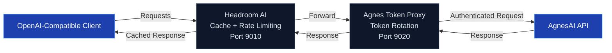

# Agnes Token Proxy

Automatic token rotation proxy for AgnesAI. Manages multiple tokens using a round-robin strategy and integrates with Headroom AI for caching and request optimization.

## Requirements

| Requirement | Version |
|------------|---------|
| Headroom AI | ≥ 0.39.1 |
| Rust Toolchain | Stable |
| AgnesAI Tokens | Valid |

- Get your tokens here: https://platform.agnes-ai.com/
- Headroom GitHub: https://github.com/headroomlabs-ai/headroom
- Rust: https://rust-lang.org/tools/install/

## Architecture



### How It Works

1. **Headroom AI** (port 9010): receives client requests, applies caching and rate limiting.
2. **Agnes Proxy** (port 9020): receives requests from Headroom, selects a token using round-robin, and forwards the request to AgnesAI.
3. **Token Rotation**: distributes requests evenly across all registered tokens.
4. **HTTPS**: uses rustls with native system certificates for secure connections.

## agnes-2.5-flash Model

| Specification | Value |
|--------------|-------|
| Input Tokens | Up to **512K** context |
| Output Tokens | Up to **65.5K** |
| Context Window | **512K tokens** |
| API | **OpenAI-compatible** |
| Endpoint | `/v1/chat/completions` |
| Reasoning | **Yes** |
| Tool Calling | **Yes** |
| Vision | **Yes**, via image input |
| Streaming | **Yes** |
| Speed | High, Flash model |
| Cost | **Currently free during promotion**; reference pricing: $0.03/M input and $0.15/M output |

## Installation

```bash
# Build
cargo build --release

# Binary:
# target/release/agnesproxy.exe (~3.5 MB)

# Add tokens
./target/release/agnesproxy add <token1>
./target/release/agnesproxy add <token2>

# Start (interactive menu)
./target/release/agnesproxy
```

### Or use the prebuilt CLI

https://github.com/tlipe/agnesproxy/releases

## Usage

Works with any OpenAI-compatible client.

Set `BASE_URL` to:

```text
http://127.0.0.1:9010/v1
```

### OpenCode

```bash
OPENAI_BASE_URL=http://127.0.0.1:9010/v1 open-code
```

### Claude Code

```bash
ANTHROPIC_BASE_URL=http://127.0.0.1:9010 claude
```

### Codex / OpenAI CLI

```bash
OPENAI_BASE_URL=http://127.0.0.1:9010/v1 codex
```

### Cursor / IDEs

Add the following environment variables:

```env
OPENAI_BASE_URL=http://127.0.0.1:9010/v1
OPENAI_API_KEY=key123
```

### Direct Endpoint

```bash
curl http://127.0.0.1:9020/v1/chat/completions \
  -H "Content-Type: application/json" \
  -H "Authorization: Bearer key123" \
  -d '{
    "model": "agnes-2.5-flash",
    "messages": [
      {
        "role": "user",
        "content": "Hello"
      }
    ]
  }'
```

## Templates

### OpenCode

```json
{
  "agnes-ai": {
    "name": "Agnes AI",
    "npm": "@ai-sdk/openai-compatible",
    "options": {
      "baseURL": "http://127.0.0.1:9010/v1",
      "apiKey": "key123"
    },
    "models": {
      "agnes-2.5-flash": {
        "name": "Agnes 2.5 Flash",
        "limit": {
          "context": 524288,
          "output": 65536
        },
        "modalities": {
          "input": ["text", "image"],
          "output": ["text"]
        },
        "reasoning": true,
        "variants": {
          "low": {
            "effort": "low"
          },
          "medium": {
            "effort": "medium"
          },
          "high": {
            "effort": "high"
          }
        }
      }
    }
  }
}
```

## Commands

| Command | Description |
|----------|-------------|
| *(no arguments)* | Opens the interactive menu |
| `init` | Starts Proxy (9020) and Headroom (9010) directly |
| `add <token>` | Adds a token to the pool |
| `list` | Lists all registered tokens |
| `remove` | Removes a token (interactive menu) |

## Implementation

- **Language:** Rust
- **HTTP/HTTPS:** hyper + hyper-rustls + rustls
- **Async Runtime:** tokio
- **CLI:** clap
- **Token Storage:** JSON file located at `~/.config/agnes-token-proxy/tokens.json`
- **Rotation Strategy:** Round-robin using an atomic counter
- **Integration:** Headroom AI for caching and optimization

## License

Apache 2.0
